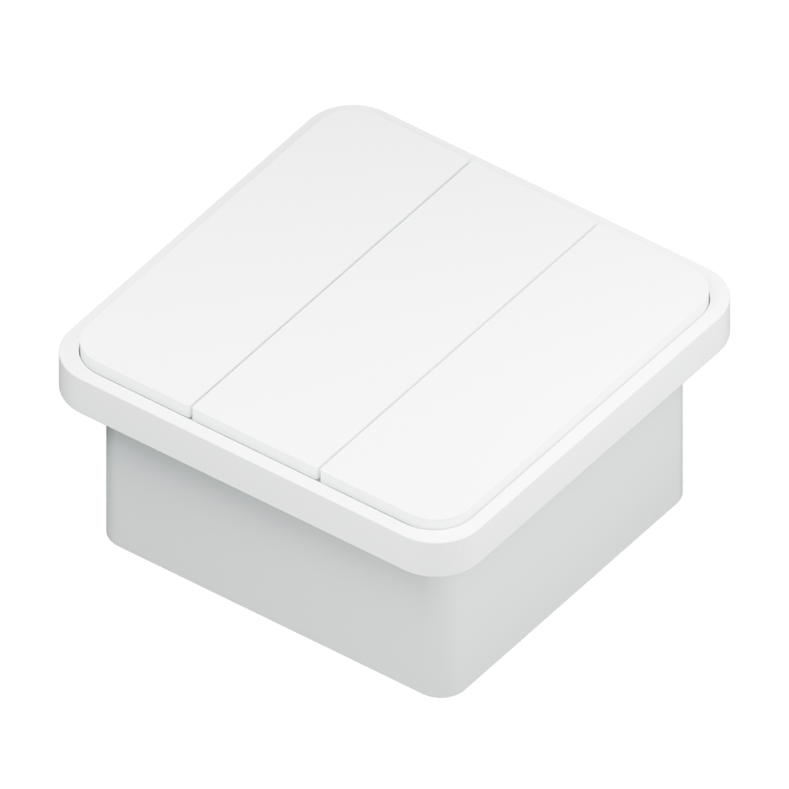

# CARBENTRA Switch · 三路智能灯光开关

面向普通照明的三路独立远程通断工程候选。保留本地按键，使用 Wi-Fi 连接 MQTT，蓝牙负责安全配网；计量三路灯具的合计用电。外观参考用户提供的白色圆角三键开关图片，内部结构、电路和固件为独立设计。

## 从这里开始

- **构建验证**：[LOCAL_BUILD.md](LOCAL_BUILD.md)，PowerShell 7 / uv Python 3.12 / MSVC / KiCad 10 / Blender 5.2 / ESP-IDF 5.4.3。
- **改外壳**：`mechanical/` 的可编辑 Blender 源文件与参数化生成脚本
- **改电路**：KiCad 10 打开 `electronics/power.kicad_pro` 或 `electronics/control.kicad_pro`
- **查元器件**：`electronics/bom.csv`、`pinmap.csv`、`mechanical_interface.json`
- **制造与展示**：[GitHub Releases](https://github.com/hicancan/carbentra-smart-switch/releases) 提供 Gerber/钻孔、GLB/STL、图片/PDF/视频与默认禁止吸合的开发固件。
- **继续固件**：[固件说明](firmware/README.md)、[协议与条件](docs/firmware.md)、[实际目标构建报告](firmware/build-report.json)
- **安全修复复验**：[本次固件修复报告](firmware/remediation-report.json)：证书日期配置、实际 ESP32-C3 编译负控与独立 host 证书负控；不代替实物 TLS 握手或现场安全验证
- **了解电气前提**：[电路说明](docs/electronics.md)、[结构说明](mechanical/README.md)

## 已实现的范围

- 三路控制、本地按键防抖、开机先释放、上电OFF；工程构建默认禁止继电器吸合，独立编译放行与逐台commissioning后才允许ON
- 每通道15分钟手动保持、保护/维护/故障守卫，真实本地输入与独立sample序号；网络不能隐式覆盖本地保持
- Wi-Fi 与双向 TLS MQTT 远程命令；时效、序列及幂等处理
- 官方 BLE Security 2 配网，需独立的设备工厂配置；没有内嵌通用密码
- MCP39F511A 串口计量读取、校验与累计能量保存；校准缺失、数据过期或异常时不伪造读数
- 实际 ESP-IDF 5.4.3 / ESP32-C3 目标构建通过，具体结果与源/产物哈希见构建报告

共享设备语义与运行时以 [carbentra-campus-platform](https://github.com/hicancan/carbentra-campus-platform) 的 `packages/iot-contract` 和 `edge` 为唯一实现；lighting-1..3 映射为 relay.1..3，合计电量只计一次。本次 Windows 原生编译、主机回归、ERC/DRC、网络连通、8 mm 隔离与八条主电流路径检查见[验证摘要](verification/local-validation.json)。

可生成的大文件已移出 Git，构建只写指定的外部目录。电路复现边界为原生 KiCad → 严格检查 → 制造输出；旧一次性生成与自动布线工具退入 Git 历史，不承诺重新自动布线得到相同 PCB。

蓝牙在本版本中用于配网，并非另一个直接开关灯协议。计量对象是三路照明合计，不提供单路电量；开关自身待机耗电不在这条分流测量通路内。继电器软件输出状态不等于实际触点或灯具状态的独立回读。

## 尺寸与安装假设

参考图没有确认厂商型号或官方尺寸。本设计提出 86 × 86 mm 面板、9.8 mm 前部突出、74 × 70 × 34 mm 后盒，总包络为 86 × 86 × 43.8 mm。需要根据实际墙腔、螺钉与导线弯曲空间核对，不能当作所有“86底盒”通用安装承诺。

电气方案假设开关盒中具备零线，采用 220–240 V AC、50 Hz 输入。不包含单火线、调光或调色温方案；不需要把灯具回流零线接回该开关盒。

## 使用边界

这是未上电、未安装、未经过实物验证的工程文件。规则检查和成功编译不等同于电气安全、温升、浪涌、EMC、射频、灯具启动冲击或计量精度认证。制造输出不是量产放行文件，需由合格人员完成器件、装配及样机验证。

仅针对普通照明研究，不用于消防应急或其他安全关键照明。远程 OFF 不构成维修隔离；一次保护元件和最终负载能力必须按现场条件验证。

许可证范围见 [LICENSES.md](LICENSES.md)。本地 KiCad 库、SDK、厂商资料继续遵守各自许可；参见 [电路第三方说明](electronics/THIRD_PARTY.md)和[固件第三方说明](firmware/THIRD_PARTY_NOTICES.md)。
